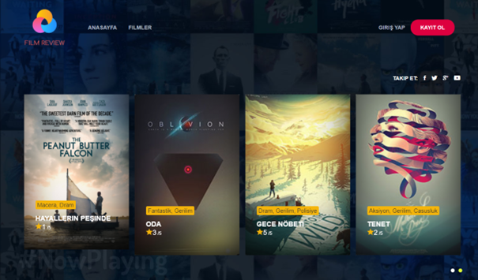

# FilmRate

It is a platform where guests can get information about movies and see the comments and ratings of other guests.

Visual Studio was used for the using of web based application.

- As a architect of MVC was used.
- Bootstrap was used for the visual contect.
- Code First Approach was applicated with Entity Framework.

